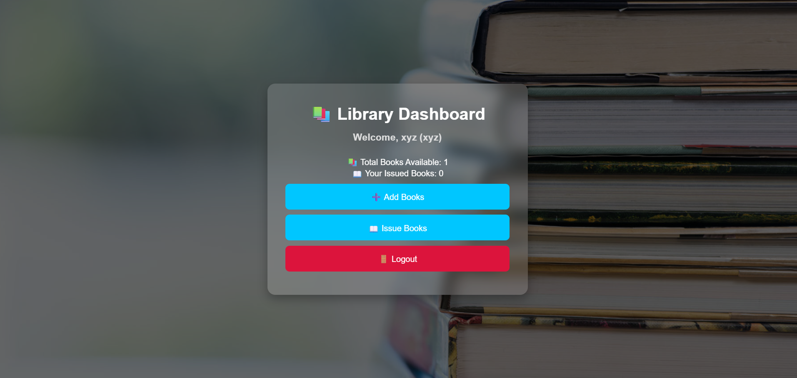
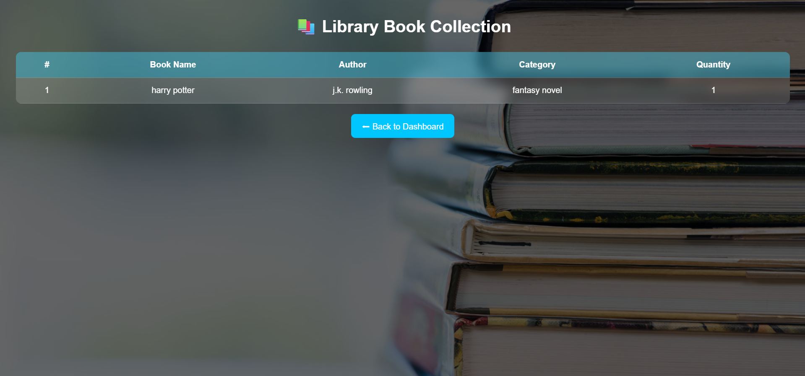

# Library_Management_system
This project is a Library Management System designed to manage student registration, login, book addition, book issuing, and book viewing in a simple digital environment.  It works as a mini online library where students can register, log in, and interact with library resources through different pages.

**How to Run the Project**

📋 **Prerequisites:**

   1.A web browser (Google Chrome / Edge / Firefox recommended)
   
   2.VS Code (recommended for editing)
   
   3.Live Server extension in VS Code (for easy local running)
   
**🚀 Steps to Run:**

1️. Download / Create Project Folder

Create or extract your project folder:

     library/
     
2. Open in VS Code
 
    File → Open Folder → library

4. Run with Live Server

👉 Right click:

    register.html
    
👉 Click:

    Open with Live Server

    
📝 **Features**

1. 👨‍🎓 Student Authentication:

📌 Registration:New students can create an account

Stores:

    I. Name
    
    II. Email
    
    III. Username
    
    IV. Password
    
2. 🔐 Login:Only registered students can log in

    I. Username + password verification
   
    II. Redirects to dashboard

4. 🏠 Dashboard Features:

  I. 📊 Personalized Dashboard:
  
      1.Welcome student by name
      
      2.Total books available
      
      3.Personal issued books count
      
      4.Secure logout
      
  II. 📚 Book Management:
  
     1. Add Books
     
     2. Book Name
     
     3. Author
     
     4. Category
     
     5. Quantity

    
4.📖 Issue Books:Issue books to logged-in student only

     1. Student-specific privacy
     
     2. Issue Date
     
     3. Return Date

     
5.📋 View Books:

     1. Displays all books in library
     
     2. Table format for organized viewing

      
⚙️**Technologies Used**
Frontend:
1️. HTML5
2️. CSS3
3️. Java

## User Interface
Here are some screenshots of the Library Management system :

### Registration Page

### Login page

### Dashboard

### Add_Books Page

### Issue_Book Page

### View_Books Page

